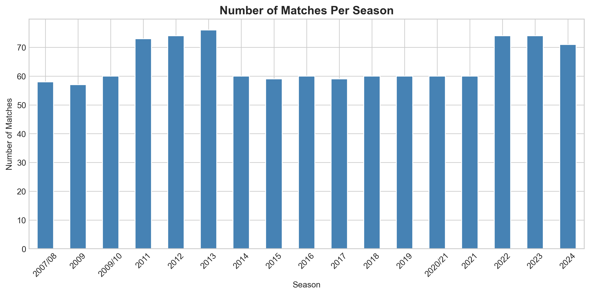
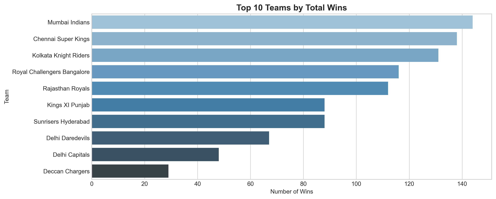
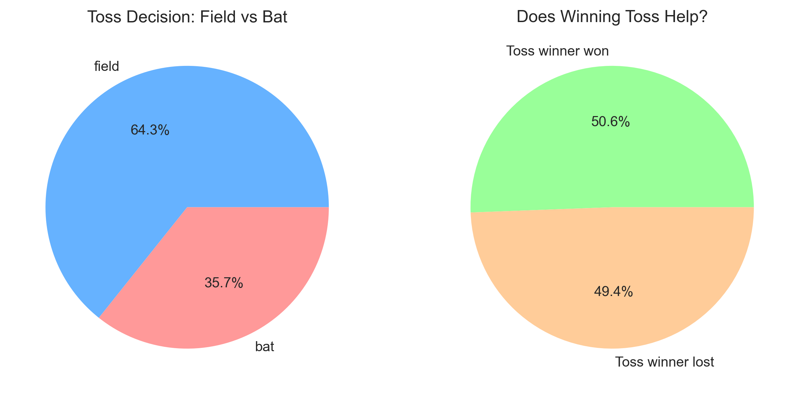
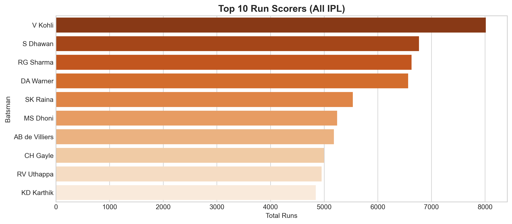
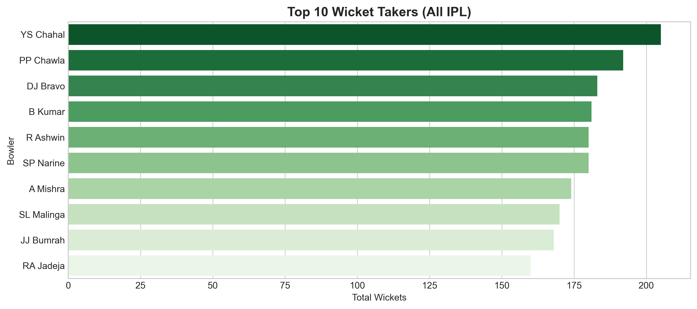
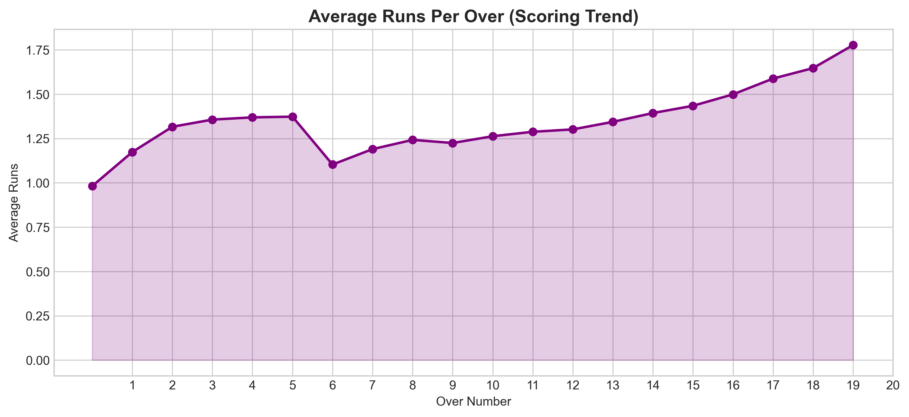
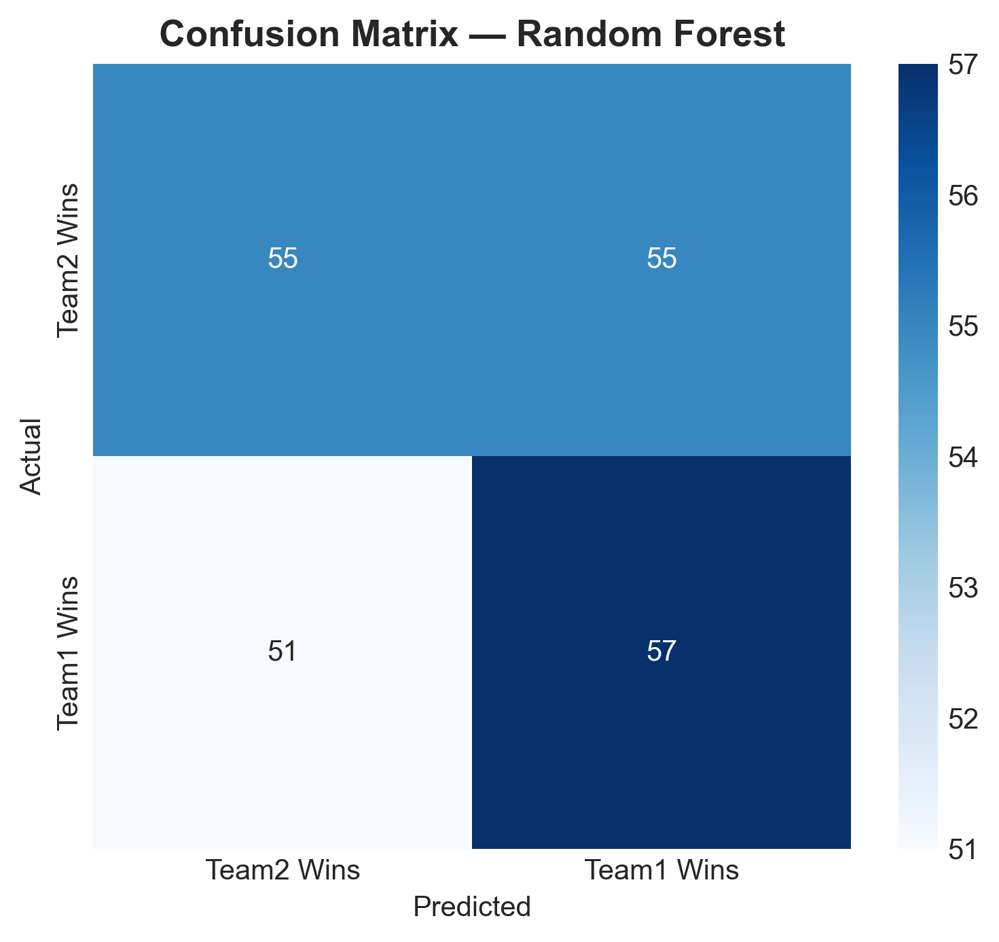
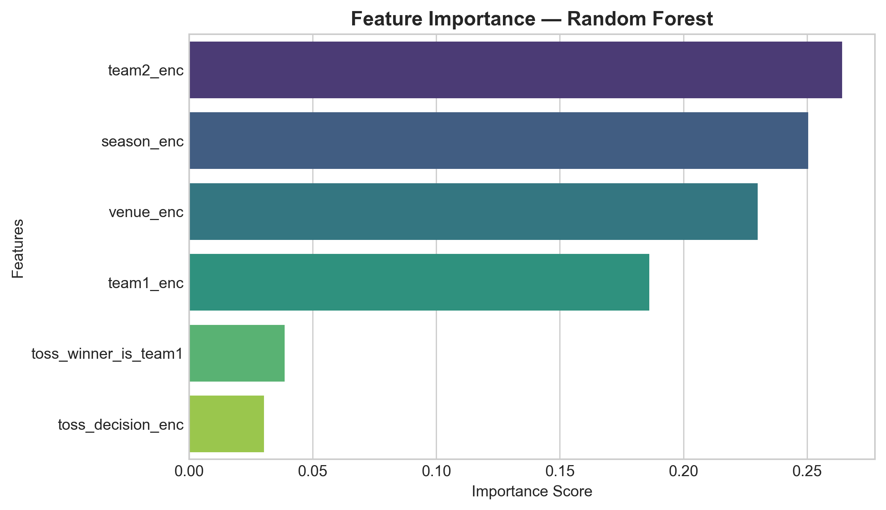

# IPL Data Analysis and Machine Learning

This is a beginner-friendly Data Science and Machine Learning project where I analyzed IPL match data using Python.  
The project focuses on understanding IPL match trends through Exploratory Data Analysis (EDA), data visualization, feature engineering, and basic machine learning models.

---

## Project Overview

In this project, I worked with IPL datasets from 2008–2022 to explore match statistics and build basic machine learning models for match outcome analysis.

The project covers:
- Data Cleaning
- Exploratory Data Analysis (EDA)
- Data Visualization
- Feature Engineering
- Machine Learning Model Training
- Model Evaluation

---

## Dataset

Dataset used:
- `matches.csv`
- `deliveries.csv`

Dataset source:  
https://www.kaggle.com/datasets/patrickb1912/ipl-complete-dataset-20082020

The dataset contains:
- Match-level IPL data
- Ball-by-ball delivery data
- Team information
- Toss details
- Match results
- Player statistics

---

## Technologies Used

- Python
- Pandas
- NumPy
- Matplotlib
- Seaborn
- Scikit-learn
- Jupyter Notebook

---

## Project Structure

```text
ipl-data-analysis/
│
├── data/
│   ├── deliveries.csv
│   └── matches.csv
│
├── images/
│   └── graphs/
│       ├── average_runs_per_over.png
│       ├── matches_per_season.png
│       ├── random_forest_confusion_matrix.png
│       ├── random_forest_feature_importance.png
│       ├── top_10_run_scorers.png
│       ├── top_10_teams_by_wins.png
│       ├── top_10_wicket_takers.png
│       └── toss_decision_analysis.png
│
├── models/
│   └── ipl_match_predictor.pkl
│
├── notebooks/
│   └── ipl_data_analysis.ipynb
│
├── reports/
│   ├── logistic_regression_report.txt
│   └── random_forest_report.txt
│
├── .gitignore
├── README.md
└── requirements.txt
```

---

## Exploratory Data Analysis (EDA)

In this project, I analyzed and visualized:
- Number of matches played per season
- Team win statistics
- Toss decision patterns
- Toss impact on match results
- Top run scorers in IPL history
- Top wicket takers
- Average runs scored per over

---

## Sample Visualizations

### Matches Played Per Season



---

### Top 10 Teams by Wins



---

### Toss Decision Analysis



---

### Top 10 Run Scorers



---

### Top 10 Wicket Takers



---

### Average Runs Per Over



---

### Random Forest Confusion Matrix



---

### Random Forest Feature Importance



---

## Machine Learning Models Used

I trained and evaluated the following classification models:
1. Logistic Regression
2. Random Forest Classifier

---

## Model Evaluation

The models were evaluated using:
- Accuracy Score
- Classification Report
- Confusion Matrix

Among the models used, the Random Forest model performed better than Logistic Regression on the IPL dataset.

---

## Key Insights

Some insights from the analysis:
- Toss decisions can influence match outcomes
- Venue plays an important role in team performance
- Certain teams consistently performed well across seasons
- Scoring rates increase significantly during death overs
- Historical IPL data can be used for match outcome analysis

---

## How to Run the Project

### 1. Clone the Repository

```bash
git clone https://github.com/gova-tech-25/ipl-data-analysis.git
```

### 2. Navigate to Project Folder

```bash
cd ipl-data-analysis
```

### 3. Install Required Libraries

```bash
pip install -r requirements.txt
```

### 4. Launch Jupyter Notebook

```bash
jupyter notebook
```

### 5. Open Notebook

Open:

```text
notebooks/ipl_data_analysis.ipynb
```

---

## Future Improvements

Some future improvements for this project:
- Add player-level statistics
- Use advanced ML models like XGBoost
- Build an IPL score prediction system
- Create a Streamlit web application
- Deploy the project online
- Use live IPL APIs for real-time analysis

---

## Conclusion

This project helped me understand the complete beginner workflow of Data Analysis and Machine Learning using real-world IPL cricket data.

Through this project, I learned:
- Data preprocessing
- Data visualization
- Feature engineering
- Machine learning basics
- Model evaluation techniques

This project also helped me improve my practical understanding of Python libraries used in Data Science and Machine Learning.